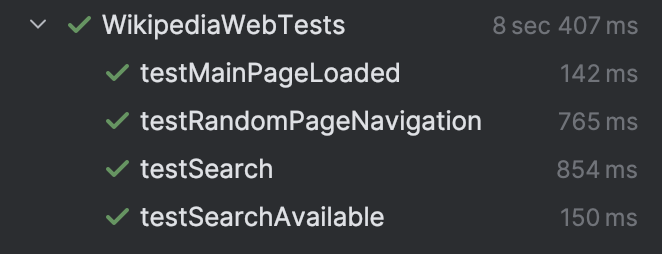
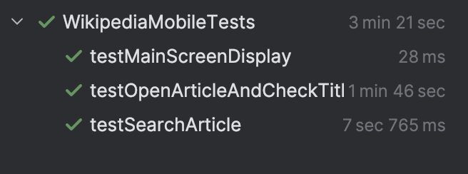

#  Автоматизированные тесты для веб- и мобильного приложения.

## Нужно для запуска
- Java 
- Maven
- Браузер Chrome
- Appium
- Android Studio
- Приложение Wikipedia должно быть установлено (например: отсюда https://github.com/wikimedia/apps-android-wikipedia/releases/tag/latest)

## Установка и запуск проекта

1. Клонировать/скачать с гитхаба
2. Установить зависимости:
   ```bash
   mvn clean install
   ```
3. Установка Appium

На мак ос:
```bash
brew install appium
```

4. Установка Anroid Studio
https://developer.android.com/studio/run/emulator?hl=ru
Настройка переменных окружения Android

Appium требует переменные `ANDROID_HOME`;
/Users/имя компьютера/Library/Android/sdk
текст:
```bash
export ANDROID_HOME=/Users/имя компьютера/Library/Android/sdk
export PATH=$ANDROID_HOME/platform-tools:$PATH
export PATH=$ANDROID_HOME/tools:$PATH
export PATH=$ANDROID_HOME/tools/bin:$PATH
```
Настройте ANDROID_HOME в терминале в ~/.zshrc.

```bash
source ~/.zshrc
```
Перезапустите IntelliJ IDEA и терминал

5. Запуск эмулятора и проверка подключения:

   1. Запустите эмулятор в Android Studio
   2. Проверьте подключение:
      ```bash
      adb devices
      ```
      Должно показать:
      emulator-5554    device

6. Установка Wikipedia на эмулятор

Через APK:
```bash
adb install путь_к_файлу/wikipedia.apk
```

7. Настройка проекта
Заменить `emulator-5554` на имя вашего устройства

8. Запуск Appium Server

```bash
appium
```

## Тесты

### Веб-тесты
Просто запустить файл в ide
### Мобильные тесты

Перед запуском убедитесь, что:
- Appium запущен
- Эмулятор подключен
- Wikipedia установлена и открыта на главной странице
Далее просто запускаем файл тестов
## Пример успешного прохождения тестов

### Веб-тесты

### Мобильные тесты

